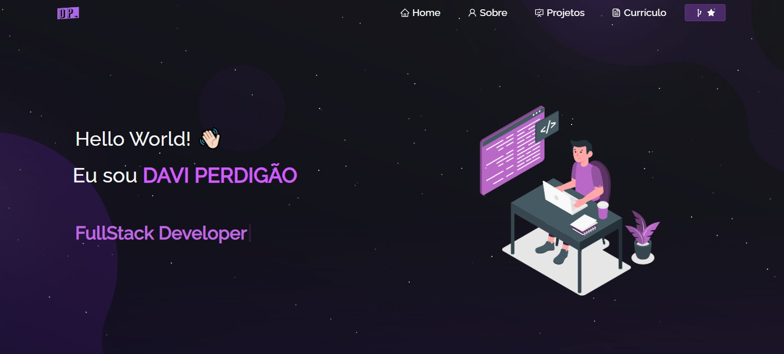

<h2 align="center">
  Portfólio Website - Davi Perdigão 
  <a href="https://davi-perdigao.vercel.app/" target="_blank">davi-perdigao.vercel.app</a>
</h2>

  

 

   &nbsp;

## 🛠 Construído com

Meu portfólio pessoal <a href="https://davi-perdigao.vercel.app/" target="_blank">davi-perdigao.vercel.app</a> que apresenta alguns dos meus projetos no GitHub, bem como meu currículo e habilidades técnicas. 

Esse projeto foi construído utilizando as seguintes tecnologias:

- React.js
- Node.js
- Express.js
- CSS3
- VsCode
- Vercel

## 📌 Características

**📖 Layout de várias páginas**

**🎨 Estilizado com React-Bootstrap e CSS**

**📱 Totalmente Responsivo**

### Mostre seu Apoio

Dê uma ⭐ se você gostou deste site!
